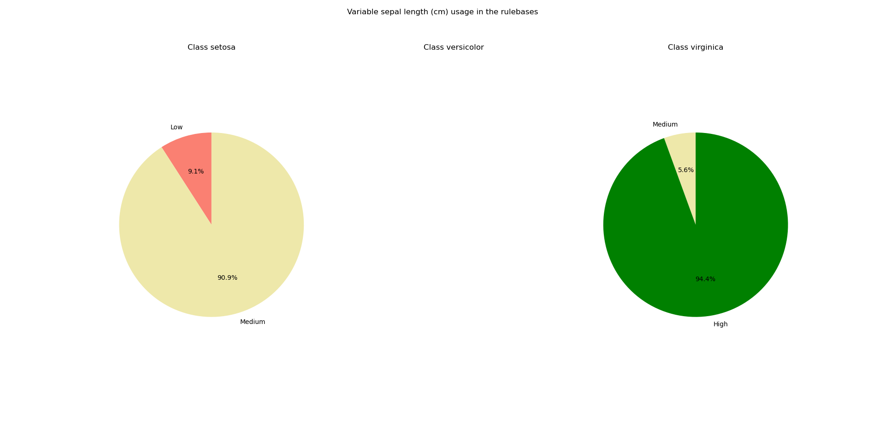

.. _pattern_stats:

Bootstrapping and rule robustness
=================================

There are two sources of uncertainty that we are interested to quantify when using an ex-Fuzzy classifier if we want reliable predictions. This library offers tools to:

1. Quantify the uncertainty due to the variability in the rulebases generated by the genetic optimization process.
2. Quantify the uncertainty due because of variability in the data.

The first type of uncertainty can be analyzed using the pattern stability tools described below. The second type of uncertainty can be analyzed using Bootstrapping methods.

Variability in the rulebases due to the genetic optimization
------------------------------------------------------------

Due to the nature of the genetic optimization, we might obtain different rulebases for the same dataset if we run the experiment with different seeds. Due to the nature of rule-based reasoning, we can directly study how often some patterns appear and how useful variables are by directly analyzing the different rulebases and the way in which their rules use each variable.

The module ``ex_fuzzy.pattern_stability`` contains a series of functions to analyze the ocurrences of the patterns when the same experiment is run with different seeds. This module comes with the class ``ex_fuzzy.pattern_stability.pattern_stabilizer`` whose initialization sets the parameters for the analysis. Then, the function ``ex_fuzzy.pattern_stability.stability_report`` can be used to run the experiments. Finally, use ``ex_fuzzy.pattern_stability.pattern_stabilizer.text_report`` to obtain a text report of the rules obtained and how often they appeared in the experiments. Use ``ex_fuzzy.pattern_stability.pattern_stabilizer.pie_chart_class`` and ``ex_fuzzy.pattern_stability.pattern_stabilizer.pie_chart_var`` to obtain pie charts of the ocurrences of the variables per class according to the linguistic variables used.

This is an example of a textual report:

.. code-block:: python

    Pattern stability report for 20 generated solutions
    Average accuracy: 0.89\pm0.07
    -------------
    Class setosa
    Number of unique patterns: 5
    Pattern IF sepal width (cm) IS High AND petal width (cm) IS Low appears in 0.80 percent of the trials with a Dominance Score of 0.6426666666666668
    Pattern IF sepal length (cm) IS Medium AND petal length (cm) IS Low appears in 0.30 percent of the trials with a Dominance Score of 0.157580748308667
    Pattern IF sepal length (cm) IS Medium AND petal length (cm) IS Low AND petal width (cm) IS Low appears in 0.20 percent of the trials with a Dominance Score of 0.11489674513650276
    Pattern IF petal width (cm) IS Low appears in 0.15 percent of the trials with a Dominance Score of 0.8502504508114606
    Pattern IF sepal length (cm) IS Low AND petal width (cm) IS Low appears in 0.05 percent of the trials with a Dominance Score of 0.7395212506106495

    Variable sepal length (cm)
    Medium appears 0.50 times
    Low appears 0.05 times

    Variable sepal width (cm)
    High appears 0.80 times

    Variable petal length (cm)
    Low appears 0.50 times

    Class versicolor
    Number of unique patterns: 1
    Pattern IF petal length (cm) IS Medium appears in 1.00 percent of the trials with a Dominance Score of 0.8733799262279169

    Variable petal length (cm)
    Medium appears 1.00 times

    Class virginica
    Number of unique patterns: 5
    Pattern IF sepal length (cm) IS High AND petal length (cm) IS High appears in 0.80 percent of the trials with a Dominance Score of 0.7115082780467393
    Pattern IF sepal width (cm) IS High AND petal length (cm) IS High appears in 0.15 percent of the trials with a Dominance Score of 0.2558635394456291
    Pattern IF sepal width (cm) IS Low appears in 0.05 percent of the trials with a Dominance Score of 0.15428571428571428
    Pattern IF sepal length (cm) IS Medium appears in 0.05 percent of the trials with a Dominance Score of 0.04656319290465636
    Pattern IF sepal length (cm) IS High appears in 0.05 percent of the trials with a Dominance Score of 0.6360683760683757

    Variable sepal length (cm)
    High appears 0.85 times
    Medium appears 0.05 times

    Variable sepal width (cm)
    High appears 0.15 times
    Low appears 0.05 times

    Variable petal length (cm)
    High appears 0.95 times

The pie charts look like this:

.. image:: images/Class_usage_setosa.png
    :width: 400

Bootstrapping
-------------

Bootstrapping is a resampling method that allows us to estimate the variability of a statistic by resampling the data with replacement. The idea is to generate a large number of datasets by resampling the original dataset and then train the classifier on each of these datasets. The variability of the predictions obtained on these datasets can be used to estimate the variability of the predictions on the original dataset.

By resampling a large amount of samples from the original training set, we can estimate the variability of the quality metrics and construct confidence intervals for them. This can be done by setting the flag p_value_compute to True in the function ex_fuzzy.evolutionay_fit.BaseFuzzyRulesClassifier.fit. The function will return the p-values for the quality metrics obtained in the training set. it also computes the following p-values which are useful to test the robustness of the patterns found:

1. Class structure: the default hypothesis is that a radom rule would find a similar performance to the one found by the rule. [1]
2. Feature coalition: the default hypothesis is that the coalition of features found in the rule is not relevant. [1]
3. Membership validation: the default hypothesis is that samples belonging to the target class have the same average value as those that do not belong to the target class.

For confidence intervals of the rule support and rule confidence  we just compute these values for each sample and return the interval where 95% of the values lie.

    
