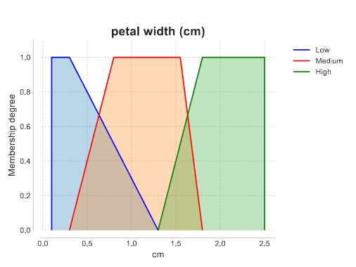
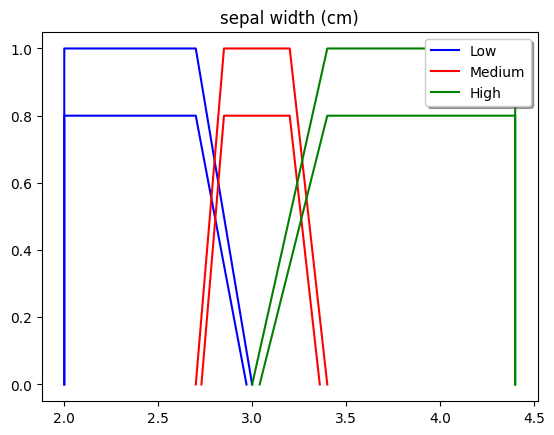
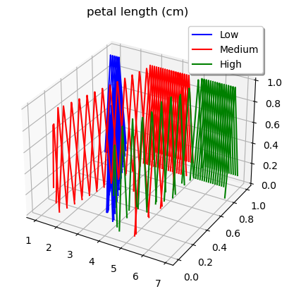

.. _step4:

Inspect rules and fuzzy sets
============================
Ex-Fuzzy can print the rules obtained after training and visualize the learned
fuzzy sets.
The easiest way to do this is using the ``eval_tools.eval_fuzzy_model`` function::

    import ex_fuzzy.eval_tools as eval_tools
    eval_tools.eval_fuzzy_model(fl_classifier, X_train, y_train, X_test, y_test,
                                print_rules=True, plot_partitions=True)

This function prints the model performance and rules, and plots the fuzzy
partitions.

--------------------
Visualize Fuzzy Sets
--------------------

Each fuzzy set is also visualized according to its own kind. The same linguistic variable can be visualized using T1, IV and GT2 fuzzy sets:

